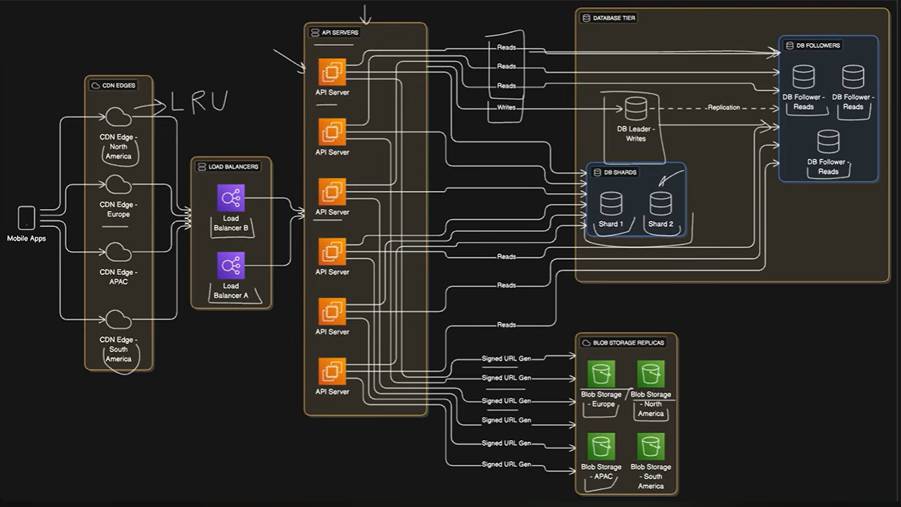

# System Design Interview — Design Spotify

## 1. Requirements & Assumptions

### Scale

* ~500K users
* ~30M songs

### Core Requirements

* Artists can upload their songs.
* Users can search and play songs.
* Users can create and manage playlists.
* Users can maintain profiles.
* Basic monitoring and observability:

  * Health checks
  * Error tracking
  * Performance metrics

### Audio Format

Use **Ogg** and **AAC** files with different bitrates for adaptive streaming.

Example:

* **64 kbps** — mobile data saving
* **128 kbps** — standard quality
* **320 kbps** — premium users

### Storage Assumption

* One song at standard audio quality ≈ **3 MB**

---

# 2. Capacity Planning

## Song Storage

* `3 MB × 30M songs ≈ 90 TB` of raw audio data.
* This does **not** include replicas across different regions.
* It also does **not** include versioning overhead when artists re-upload songs.
* Therefore, plan for roughly **2–3×** the raw storage requirement.

### Estimated Storage

* Raw audio: **~90 TB**
* With replication/versioning: **~180–270 TB**

---

## Song Metadata

Each song requires metadata such as:

* Title
* Artist references
* Duration
* File URLs
* Other song-related information

Assumption:

* ~100 bytes per song
* `100 bytes × 30M songs ≈ 3 GB`

Compared with audio storage, metadata storage is practically negligible.

---

## User Metadata

Includes:

* User profiles
* Preferences
* Playlist data

Assumption:

* ~1 KB per user
* `1 KB × 500K users ≈ 0.5 GB`

---

## Daily Bandwidth

Assumptions:

* Average listening time: **3.5 minutes**
* Average bitrate: **128–160 kbps**
* Approximately **3–4 MB per stream**
* Each user streams **10–15 songs/day**

This results in significant daily bandwidth consumption and therefore significant **egress costs**.

---

# 3. High-Level Architecture

```text
                         ┌─────────────────────┐
                         │    SQL Database     │
                         │      Metadata       │
                         └──────────▲──────────┘
                                    │
                              Metadata Queries
                                    │
┌──────────────┐     ┌─────────────┴─────────────┐
│  Mobile App  │────▶│       Load Balancer       │
└──────────────┘     └─────────────┬─────────────┘
                                    │
                                    ▼
                       ┌─────────────────────────┐
                       │       Web/API Layer     │
                       │                         │
                       │  API Server 1           │
                       │  API Server 2           │
                       │  API Server 3           │
                       └────────────┬────────────┘
                                    │
                           Generate Signed URLs
                                    │
                                    ▼
                         ┌─────────────────────┐
                         │    Blob Storage     │
                         │     Audio Files     │
                         └─────────────────────┘
```

### Components

#### Mobile App

* Sends HTTP requests to the backend.
* Requests song metadata.
* Receives signed URLs.
* Streams audio directly from blob storage.

#### Load Balancer

* Receives incoming HTTP requests.
* Distributes requests across API servers.
* Prevents a single API server from becoming a bottleneck.

#### API Layer

Multiple API servers provide:

* Authentication
* Song metadata APIs
* Playlist APIs
* User APIs
* Upload APIs
* Signed URL generation
* Analytics/event endpoints

#### SQL Database

Stores relatively small structured metadata:

* Songs
* Artists
* Albums
* Users
* Playlists
* Song/artist mappings
* Other relational data

#### Blob/Object Storage

Stores large binary audio files.

Examples:

* Original audio files
* Encoded audio files
* Different bitrate versions

The API server generates **signed URLs** so clients can access audio securely without routing the actual audio data through the API servers.

---

# 4. System Workflow

## 4.1 Long Playback — Read Flow

### Request Flow

```text
User
  │
  │ Hits Play button
  ▼
Mobile App
  │
  │ GET /songs/{id}
  ▼
Load Balancer
  │
  │ Route request
  ▼
API Server
  │
  │ Validate JWT token
  │
  ├──────────────▶ SQL Database
  │                 Query song metadata
  │
  │◀───────────────
  │                 Return song details
  │
  │ Generate signed URL
  │
  ▼
Mobile App
  │
  │ Range requests for audio chunks
  ▼
Blob Storage
  │
  │ Stream audio data
  ▼
Mobile App
```

### Detailed Steps

1. User hits the **Play** button.

2. Mobile app sends:

   ```http
   GET /songs/{id}
   ```

3. Load balancer routes the request to an API server.

4. API server validates the **JWT token**.

5. If the JWT is valid:

   * Query song metadata from SQL.
   * Return song details.
   * Generate a signed URL for the audio file.

6. API returns:

   ```text
   Song metadata + Signed URL
   ```

7. Mobile app uses the signed URL to request audio chunks from blob storage.

8. Audio is streamed using **HTTP Range Requests**.

9. Mobile app sends a playback analytics event:

   ```http
   POST /songs/{id}/play
   ```

### Invalid JWT

If the JWT is invalid:

```text
API Server
    │
    ▼
Authentication failure
    │
    ▼
Return authentication error
```

The request does not proceed to the song metadata or streaming flow.

---

# 5. Audio Upload — Write Flow

## Upload Workflow

```text
Artist
  │
  │ Start audio upload
  ▼
Mobile App
  │
  │ POST /songs/upload
  │ multipart:
  │ - audio file
  │ - metadata
  ▼
Load Balancer
  │
  │ Forward upload request
  ▼
API Server
  │
  │ Validate file format & size
  │
  ├── Invalid ──────────────▶ Reject upload
  │
  └── Valid
       │
       ▼
   Blob Storage
       │
       │ Store:
       │ /pending/{upload_id}
       │
       ▼
   Extract audio metadata
       │
       │ duration
       │ bitrate
       ▼
   SQL Database
       │
       │ Insert song,
       │ artist & mapping records
       ▼
   Blob Storage
       │
       │ Move file to:
       │ /artist/{artist_id}/album/{album_id}/
       │
       ▼
   CDN Cache
       │
       │ Invalidate artist/album cache
       ▼
   Upload Successful
```

## Detailed Steps

### 1. Start Upload

Artist starts an audio upload through the mobile app.

### 2. Upload Request

The mobile app sends:

```http
POST /songs/upload
```

Using `multipart/form-data` containing:

* Audio file
* Song metadata

### 3. Load Balancer

The load balancer forwards the upload request to an API server.

### 4. Validate File

The API server validates:

* File format
* File size

### Invalid File

If the file is unsupported or too large:

```text
Reject upload
```

The artist receives an upload error.

### Valid File

If the file passes validation, continue with the upload process.

### 5. Temporary Storage

Store the uploaded file in blob storage:

```text
/pending/{upload_id}
```

This allows the system to process the upload before putting it into its final location.

### 6. Extract Audio Metadata

Extract information such as:

* Duration
* Bitrate

### 7. Insert Database Records

Insert:

* Song record
* Artist record/reference
* Mapping records

into the SQL database.

### 8. Move Audio File

After successful processing, move the file from the temporary location to its permanent path:

```text
/artist/{artist_id}/album/{album_id}/
```

### 9. Cache Invalidation

Invalidate the CDN cache for the relevant:

* Artist
* Album

This ensures newly uploaded content becomes available correctly.

### 10. Upload Successful

Return:

```text
Upload successful
(song available)
```

Yes. I understand — you want me to **recreate the system-design slides exactly as shown**, including:

1. **All text/content**
2. **The API endpoints**
3. **Database schema**
4. **Architecture diagram**
5. **Connections between components**
6. **The same logical layout/flow**, not a simplified generic version.

I can structure it like this:

---

# 5. API Design

## Search & Discovery

### Search different content types with pagination

```http
GET /search?q={query}&type=song,artist&limit=20&offset=0
```

### Get trending songs, optionally filtered by genre

```http
GET /songs/trending?genre={genre}&limit=50
```

### Get all songs by a specific artist

```http
GET /artists/{id}/songs?limit=50
```

---

## Content Access

### Get song metadata and streaming URL

```http
GET /songs/{id}
```

### Direct streaming endpoint

Alternative to signed URLs.

```http
GET /songs/{id}/stream
```

### Get playlist details with an optional song list

```http
GET /playlists/{id}?include_songs=true
```

---

# User Actions

## Create a new playlist

```http
POST /playlists
```

```json
{
  "name": "My Favorites",
  "is_public": false
}
```

## Add songs to the playlist

```http
PUT /playlists/{id}/songs
```

```json
{
  "song_ids": [123, 456, 789],
  "position": 5
}
```

## Remove a song from the playlist

```http
DELETE /playlists/{id}/songs/{song_id}
```

## Like/unlike a song

```http
POST /songs/{id}/like
```

---

# User Management

## Get the current user's playlists

```http
GET /users/me/playlists
```

## Get songs liked by the user

```http
GET /users/me/liked-songs?limit=50&offset=0
```

## Follow an artist

```http
POST /users/me/follow/{artist_id}
```

---

# 6. Data Storage

## Blob Storage

The system uses **blob storage** to store audio files.

* The audio files are **immutable**
* They rarely change once uploaded
* We organize them with a sensible folder structure

```text
/artist/{artistId}/album/{albumId}/{songId}.ogg
```

---

# Relational Database

The schema shown in the diagram contains:

### `users`

| Column           | Type        | Constraint |
| ---------------- | ----------- | ---------- |
| UserID           | bigint      | PK         |
| Email            | citext      | unique     |
| PasswordHash     | text        |            |
| CreatedAt        | timestamptz |            |
| LastLogin        | timestamptz |            |
| SubscriptionType | text        |            |
| Country          | text        |            |

### `artists`

| Column   | Type   | Constraint |
| -------- | ------ | ---------- |
| ArtistID | bigint | PK         |
| Name     | text   |            |
| Country  | text   |            |

### `songs`

| Column      | Type        | Constraint |
| ----------- | ----------- | ---------- |
| SongID      | bigint      | PK         |
| Title       | text        |            |
| Duration    | int         |            |
| ReleaseDate | date        |            |
| FileURL     | text        |            |
| CreatedAt   | timestamptz |            |
| ArtistID    | bigint      |            |

### `playlists`

| Column     | Type        | Constraint |
| ---------- | ----------- | ---------- |
| PlaylistID | bigint      | PK         |
| OwnerID    | bigint      |            |
| Name       | text        |            |
| CreatedAt  | timestamptz |            |

### `playlistitems`

| Column     | Type        | Constraint |
| ---------- | ----------- | ---------- |
| PlaylistID | bigint      | PK         |
| Position   | int         |            |
| AddedAt    | timestamptz |            |
| SongID     | bigint      | PK         |

### `artistsongs`

| Column   | Type   | Constraint |
| -------- | ------ | ---------- |
| SongID   | bigint | PK         |
| ArtistID | bigint | PK         |

---

# Database Relationships

```text
                    ┌─────────────────┐
                    │     users       │
                    │─────────────────│
                    │ UserID PK       │
                    │ Email           │
                    │ PasswordHash    │
                    │ CreatedAt       │
                    │ LastLogin       │
                    │ Subscription... │
                    │ Country         │
                    └────────┬────────┘
                             │
                             │ 1
                             │
                             │ *
                    ┌────────▼────────┐
                    │    playlists    │
                    │─────────────────│
                    │ PlaylistID PK   │
                    │ OwnerID         │
                    │ Name            │
                    │ CreatedAt       │
                    └────────┬────────┘
                             │
                             │ 1
                             │
                             │ *
                 ┌───────────▼────────────┐
                 │     playlistitems      │
                 │────────────────────────│
                 │ PlaylistID PK          │
                 │ Position               │
                 │ AddedAt                │
                 │ SongID PK              │
                 └───────────┬────────────┘
                             │
                             │ *
                             │
                             │ 1
                    ┌────────▼────────┐
                    │      songs      │
                    │─────────────────│
                    │ SongID PK       │
                    │ Title           │
                    │ Duration        │
                    │ ReleaseDate     │
                    │ FileURL         │
                    │ CreatedAt       │
                    │ ArtistID        │
                    └────────┬────────┘
                             │
                             │ *
                             │
                             │ 1
                    ┌────────▼────────┐
                    │     artists     │
                    │─────────────────│
                    │ ArtistID PK     │
                    │ Name            │
                    │ Country         │
                    └─────────────────┘


        ┌──────────────────┐
        │   artistsongs    │
        │──────────────────│
        │ SongID PK        │
        │ ArtistID PK      │
        └──────────────────┘
```

---

# 7. Scalability

## 50M Users, 200M Songs

The slide estimates:

```text
Song metadata:
100 bytes × 200M songs ≈ 20 GB

User metadata:
1 KB × 50M users ≈ 50 GB

Audio storage:
3 MB × 200M songs ≈ 600 TB
(before replicas and regional copies)
```

---

# Scalable Architecture

The architecture shown is:

```text
                         ┌──────────────────────────┐
                         │       MOBILE APPS        │
                         └────────────┬─────────────┘
                                      │
                ┌─────────────────────┼─────────────────────┐
                │                     │                     │
                ▼                     ▼                     ▼
        ┌───────────────┐     ┌───────────────┐     ┌───────────────┐
        │ CDN Edge      │     │ CDN Edge      │     │ CDN Edge      │
        │ North America │     │ Europe        │     │ APAC          │
        └───────┬───────┘     └───────┬───────┘     └───────┬───────┘
                │                     │                     │
                └─────────────────────┼─────────────────────┘
                                      ▼
                         ┌─────────────────────────┐
                         │     LOAD BALANCERS      │
                         │                         │
                         │      Load Balancer A    │
                         │      Load Balancer B    │
                         └────────────┬────────────┘
                                      │
                                      ▼
                         ┌─────────────────────────┐
                         │       API SERVERS       │
                         │                         │
                         │      API Server         │
                         │      API Server         │
                         │      API Server         │
                         │      API Server         │
                         │      API Server         │
                         │      API Server         │
                         └────────────┬────────────┘
                                      │
                 ┌────────────────────┼─────────────────────┐
                 │                    │                     │
                 ▼                    ▼                     ▼
        ┌─────────────────┐  ┌─────────────────┐  ┌──────────────────┐
        │   DB SHARDS     │  │  DB FOLLOWERS   │  │  BLOB STORAGE    │
        │                 │  │                 │  │    REPLICAS      │
        │    Shard 1      │  │ Follower Reads │  │                  │
        │    Shard 2      │  │ Follower Reads │  │ Europe           │
        │                 │  │ Follower Reads │  │ North America    │
        └─────────────────┘  └─────────────────┘  │ APAC             │
                                                  │ South America     │
                                                  └───────────────────┘
```

---

# Database Tier

The exact logical structure shown in the later diagrams is:

```text
                         DATABASE TIER
┌─────────────────────────────────────────────────────────────────┐
│                                                                 │
│                         ┌───────────────┐                       │
│                         │   DB LEADER   │                       │
│                         │    WRITES     │                       │
│                         └───────┬───────┘                       │
│                                 │                               │
│                         Replication                             │
│                                 │                               │
│                                 ▼                               │
│                 ┌───────────────────────────┐                   │
│                 │       DB FOLLOWERS         │                   │
│                 │                            │                   │
│                 │ ┌─────────┐ ┌─────────┐   │                   │
│                 │ │Follower │ │Follower │   │                   │
│                 │ │ Reads   │ │ Reads   │   │                   │
│                 │ └─────────┘ └─────────┘   │                   │
│                 │                            │                   │
│                 │       ┌─────────┐          │                   │
│                 │       │Follower │          │                   │
│                 │       │ Reads   │          │                   │
│                 │       └─────────┘          │                   │
│                 └────────────────────────────┘                   │
│                                                                 │
│                 ┌───────────────────────────┐                   │
│                 │         DB SHARDS         │                   │
│                 │                            │                   │
│                 │      ┌────────┐            │                   │
│                 │      │Shard 1 │            │                   │
│                 │      └────────┘            │                   │
│                 │                            │                   │
│                 │      ┌────────┐            │                   │
│                 │      │Shard 2 │            │                   │
│                 │      └────────┘            │                   │
│                 └────────────────────────────┘                   │
│                                                                 │
└─────────────────────────────────────────────────────────────────┘
```

### Traffic separation

```text
API Servers
    │
    ├────────────── Reads ──────────────► DB Followers
    │
    ├────────────── Writes ─────────────► DB Leader
    │
    └────────────── Data distribution ──► DB Shards
```

---

# Blob Storage Replicas

The diagram shows regional blob-storage copies:

```text
                 ┌───────────────────────────────┐
                 │    BLOB STORAGE REPLICAS      │
                 │                               │
                 │  ┌────────────┐ ┌──────────┐ │
                 │  │   Blob     │ │   Blob   │ │
                 │  │  Storage   │ │  Storage │ │
                 │  │  - Europe  │ │ - North  │ │
                 │  │            │ │  America  │ │
                 │  └────────────┘ └──────────┘ │
                 │                               │
                 │  ┌────────────┐ ┌──────────┐ │
                 │  │   Blob     │ │   Blob   │ │
                 │  │  Storage   │ │  Storage │ │
                 │  │   - APAC   │ │  - South │ │
                 │  │            │ │  America │ │
                 │  └────────────┘ └──────────┘ │
                 └───────────────────────────────┘
```

API servers generate signed URLs:

```text
API Server
    │
    ├── Signed URL Gen ──────► Blob Storage - Europe
    │
    ├── Signed URL Gen ──────► Blob Storage - North America
    │
    ├── Signed URL Gen ──────► Blob Storage - APAC
    │
    └── Signed URL Gen ──────► Blob Storage - South America
```

---

# Complete Architecture

Putting the screenshots together into **one coherent diagram**:

```text
                              MOBILE APPS
                                  │
             ┌────────────────────┼────────────────────┐
             │                    │                    │
             ▼                    ▼                    ▼
      CDN - N. America       CDN - Europe          CDN - APAC
             │                    │                    │
             └────────────────────┼────────────────────┘
                                  │
                            ┌─────▼─────┐
                            │    LRU    │
                            │   CACHE   │
                            └─────┬─────┘
                                  │
                       ┌──────────▼──────────┐
                       │    LOAD BALANCERS   │
                       │                     │
                       │   LB A       LB B   │
                       └──────────┬──────────┘
                                  │
                    ┌─────────────▼─────────────┐
                    │        API SERVERS        │
                    │                           │
                    │ API │ API │ API │ API    │
                    │ API │ API │ API │ API    │
                    └──────┬──────────┬────────┘
                           │          │
              ┌────────────┘          └─────────────┐
              │                                     │
              │ Reads                               │ Writes
              ▼                                     ▼
     ┌──────────────────┐                    ┌──────────────┐
     │   DB FOLLOWERS   │                    │  DB LEADER   │
     │                  │◄──── Replication ──│    WRITES    │
     │ Follower - Reads │                    └──────┬───────┘
     │ Follower - Reads │                           │
     │ Follower - Reads │                           │
     └──────────────────┘                           │
                                                   │
                                          ┌────────▼────────┐
                                          │    DB SHARDS    │
                                          │                 │
                                          │     Shard 1     │
                                          │     Shard 2     │
                                          └─────────────────┘


                     API SERVERS
                          │
                          │ Signed URL Generation
                          │
          ┌───────────────┼────────────────────────┐
          │               │                        │
          ▼               ▼                        ▼
     ┌──────────┐   ┌──────────┐             ┌──────────┐
     │  Europe  │   │   North  │             │   APAC   │
     │   Blob   │   │  America │             │   Blob   │
     │ Storage  │   │   Blob   │             │ Storage  │
     └──────────┘   │ Storage  │             └──────────┘
                    └──────────┘
                          │
                    ┌─────▼─────┐
                    │   South   │
                    │  America  │
                    │    Blob   │
                    │  Storage  │
                    └───────────┘
```

### Important design decisions represented in the slides

```text
                    ┌───────────────────────┐
                    │      50M USERS        │
                    │      200M SONGS       │
                    └───────────┬───────────┘
                                │
             ┌──────────────────┼──────────────────┐
             ▼                  ▼                  ▼
       CDN / LRU Cache     API Servers       Database Tier
             │                  │                  │
             │                  │          ┌───────┴────────┐
             │                  │          │                │
             │                  │       Sharding       Replication
             │                  │          │                │
             │                  │       Shard 1         Followers
             │                  │       Shard 2
             │                  │
             │                  ▼
             │             Signed URLs
             │                  │
             │                  ▼
             │            Blob Storage
             │                  │
             │        ┌─────────┼─────────┐
             │        ▼         ▼         ▼
             │      Europe    APAC     Americas
             │
             └──────► Cache popular content
```

Ref:


